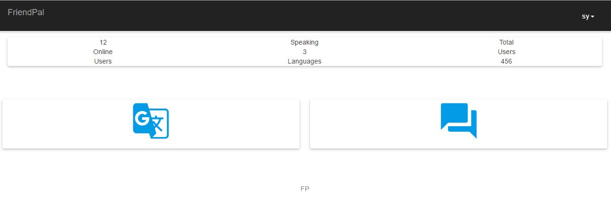
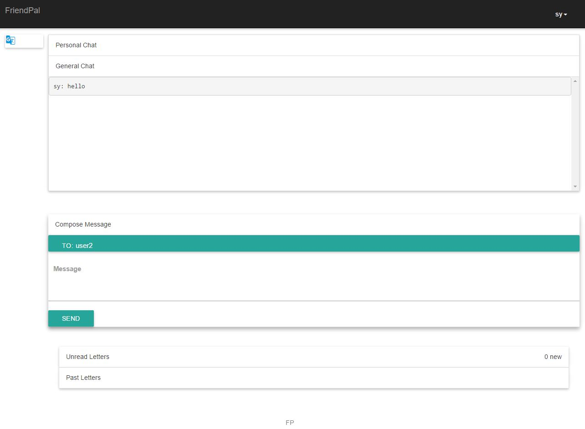
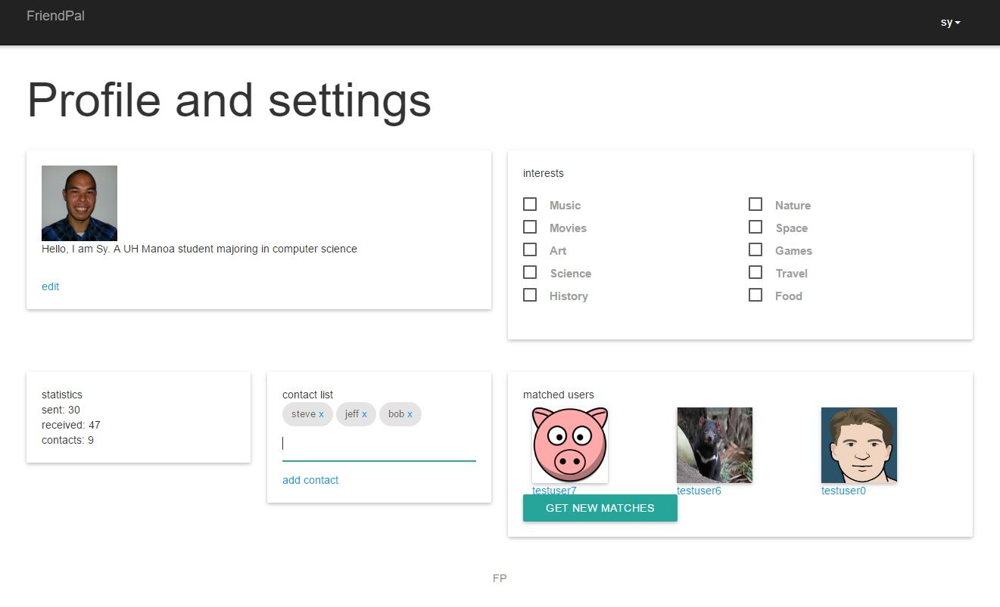

## FriendPal
FriendPal is a communication application that allows students who do not speak the same language to communicate
through letters and short messages by incorporating a translator feature. FriendPal uses University of Hawaii CAS system
for now as a test, but can be easily modified to expand to larger demographics. Friend Pal uses a matchmaking system based on your interests that helps you find new people that you might want to exchange letters with.

##Changes
4/14:
Implemented user interests.
Combined user settings and profile.
Added collections for user profiles. (still need forms to add data)
Contact list now a list of close-able chips.

5/6:
Implemeted matchmaking.
Implemeted matches prefilled to dropdown for 'To' field when composing new messages.
Consolidated contacts into settings page.

## Features
functional:
short messages,
letters,
contact list,
matchmaking,
user settings

in-development:

planned:
translator using Google API,
side-by-side viewing translated/non-translated letters,
automatically translated messages,
emoji

## Installation
A [live version](http://www.friendpal.meteor.com) of FriendPal will be available to view until March 24 2016. For
installing to try on a local machine, do the following:

Install [Meteor](https://www.meteor.com/),
Download this repository,
cd to the app directory in a command prompt or terminal,
run meteor using the settings file (use the meteor command below)

```
meteor --settings ../config/settings.development.json
```

## Walkthrough
FriendPal is simple to use. You may navigate to the home page at any time by clicking the title on the top left and login
or access your options from the menu at the top right. Before logging in, you may only use the translator
of the app (which is not functional, yet).

###Messages


After login you will have access to the messenger, which allows you to send and receive messages.
From the top of the page:
####Personal messages collapsible
messages that you have sent or received by you.
####General messages collapsible
messages that people have sent to no one or to 'general'
####Compose message collapsible.
clicking on the to: field brings up a lists your contacts and a list of people who have recently (within 24 hours) sent you a message.
####New and past letters collapsibles
shows letter-length messages, click to view the whole message.




Your contact list and settings can be accessed from the settings button at the top menu, you can add and delete contacts which get added to the dropdown menu when you click the to field when composing a message. This is also where you may edit your user bio and user image that other users will see when they look at your profile. Here, you can also edit your interests that are used for matchmaking. Friend Pal will match you with three people that it thinks you might enjoy exchanging letters with.

## Credits
FriendPal is built using [Meteor](https://www.meteor.com/) and [Materialize CSS](http://materializecss.com/)
development frameworks.
Dr. Johnson's [template](https://githu.com/ics-software-engineering/meteor-example-uh-cas) was used as a base
for this application and allows access to a test UH CAS login system.
Packages used in Meteor: accounts-password, aldeed:autoform, aldeed:collection2, atoy40:accounts-cas,
blaze-html-templates, check, ecmascript, ejson, es5-shim, ian:accounts-ui-bootstrap-3, iron:router, jquery,
meteor-base, mobile-experience, [momentjs:moment](http://momentjs.com), mongo, random, sacha:spin, session, standard-minifiers, tracker,
twbs:bootstrap, [underscore](http://underscorejs.org/).

##Contact Us

####Brian: bjboado@hawaii.edu
####Sy:    sy@hawaii.edu

##Evaluation
If you would like to evaluate our app and help us make friendpal better. Please take this [short survey](http://goo.gl/forms/PtrtS9EJEa). You may review our app as a mock-up (screenshots are provided in the survey) or run app localy by following the instalation instructions above and review a working system.
